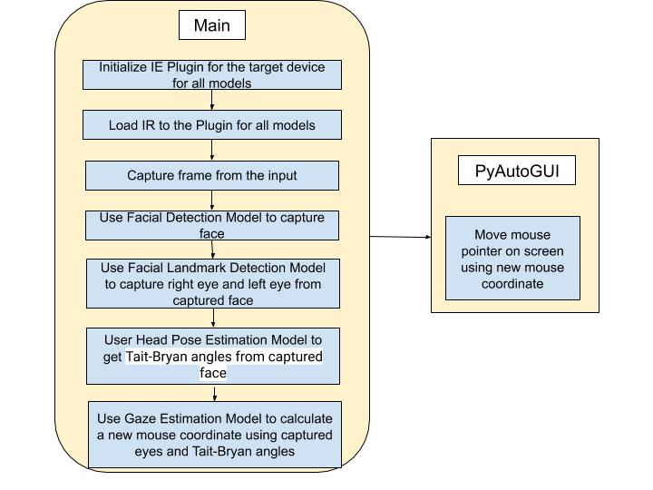

# Computer Pointer Controller

This application demonstrates how to control mouse pointer on screen with eye gaze using Intel® hardware and software tools. The app will detect a person's face, facial landmark and eye gaze angel. Mouse pointer on screen will then be moved in the gaze direction.

## How it Works

The application uses a Face Detection model to capture a person's face, a Facial Landmark Detection Model to capture left and right eye from captured face, a Head Pose Estimation Model to get Tait-Bryan angles from captured face, and then uses a gaze estimation model to calculate new mouse coordinate from captured eyes and Tait-Bryan angles.

## Project Set Up and Installation

## Requirements

### Hardware

* 6th to 10th generation Intel® Core™ processor with Iris® Pro graphics or Intel® HD Graphics.
* OR use of Intel® Neural Compute Stick 2 (NCS2)

### Software

*   Intel® Distribution of OpenVINO™ toolkit 2020
*   PyAutoGUI
*   CMake
*   NumPy
  
        
## Setup

### Install Intel® Distribution of OpenVINO™ toolkit

Utilize the classroom workspace, or refer to the relevant instructions for your operating system for this step.

- [Linux/Ubuntu](./linux-setup.md)
- [Mac](./mac-setup.md)
- [Windows](./windows-setup.md)

## Models to use

For this project we will be using 4 models: 

* [Face Detection](https://docs.openvinotoolkit.org/latest/_models_intel_face_detection_adas_binary_0001_description_face_detection_adas_binary_0001.html)
* [Head Pose Estimation](https://docs.openvinotoolkit.org/latest/_models_intel_head_pose_estimation_adas_0001_description_head_pose_estimation_adas_0001.html)
* [Facial Landmarks Detection](https://docs.openvinotoolkit.org/latest/_models_intel_landmarks_regression_retail_0009_description_landmarks_regression_retail_0009.html)
* [Gaze Estimation Model](https://docs.openvinotoolkit.org/latest/_models_intel_gaze_estimation_adas_0002_description_gaze_estimation_adas_0002.html)

The models can be downloaded using `model downloader`. To download a model, naviagate to the directory containing the model downloader 
`cd /opt/intel/openvino/deployment_tools/open_model_zoo/tools/downloader` . 
Use `--name` argument for model name, `-o` argument to specify your output directory

**Download Face Detection model**

    sudo ./downloader.py --name face-detection-adas-binary-0001 -o /home/user/Documents/Pointer_Control/models

**Download Head Pose Estimation model**

    sudo ./downloader.py --name head-pose-estimation-adas-0001 -o /home/user/Documents/Pointer_Control/models

**Download Facial Landmarks Detection model**

    sudo ./downloader.py --name landmarks-regression-retail-0009 -o /home/user/Documents/Pointer_Control/models
    
**Download Gaze Estimation model**

    sudo ./downloader.py --name gaze-estimation-adas-0002 -o /home/user/Documents/Pointer_Control/models

## Install Dependencies
**Numpy**

    pip3 install numpy

**PyAutoGUI**

    pip3 install pyautogui

**NOTE:** You must install tkinter on Linux to use MouseInfo. Run the following:

    sudo apt-get install python3-tk python3-dev

## Run APP
Run the app from `main.py` file. 
You need to parse in required arguments for model and video location. 
Arguments to parse while running the app are:

* `-mfd`: location of Face Detection Model. `Required`
* `-mflm`: location of Facecial Landmark Detection Model `Required`
* `-mge`: Location of Gaze Estimation Model `Required`
* `-mhpe`: Location of Head Pose Estimation Model `Required`
* `-d`: Device to run inference. `default = "CPU"`
* `-v`: Location of video to use for inference 
* `-l`: CPU extensions
* `-pt`: Probability Threshold for Face Detection Model

Your command to run the app should look like this:

    python3 main.py -mfd models/intel/face-detection-adas-binary-0001/FP32-INT1/face-detection-adas-binary-0001 -mflm models/intel/landmarks-regression-retail-0009/FP16/landmarks-regression-retail-0009 -mge models/intel/gaze-estimation-adas-0002/FP16/gaze-estimation-adas-0002 -mhpe models/intel/head-pose-estimation-adas-0001/FP16/head-pose-estimation-adas-0001 -d CPU -v bin/demo.mp4 -pt 0.60

## Benchmarks
The table below shows load time of the different models with different precisions on **Intel CORE i7 device**. **Face Detection Model** uses a precision of **FP32** with an average load time of **0.18 seconds**. This will be added across other models precision to get total load time.

| | FP16 | FP16-INT8 | FP32 |
|------| ------ | ------ | ------ |
|Landmarks-regression-retail-0009 load time| 0.075 | 0.229 | 0.191 |
|Gaze-estimation-adas-0002 load time| 0.121 | 0.264 | 0.321 |
|Head-pose-estimation-adas-0001 load time | 0.097 | 0.237 | 0.242 |
|**Total Load time**| **0.479** | **0.909** | **0.943** |

***Table 1: Load time of models in seconds***

**Average Inference time is 208 seconds 
Average frames per second is 2.8 seconds**

## Results
It takes less time to load models using FP16 precision. App accuracy, Inference time and Frames per second is the same across all model precisions. It is recommended to use FP32 for Face Detection model and FP16 precision for the other models

## Stand Out Suggestions
For further investigation, you can use [Deep Learning Workbench](https://docs.openvinotoolkit.org/latest/_docs_Workbench_DG_Install_from_Package.html) to get model performance summary, and [VTune Amplifier](https://software.intel.com/content/www/us/en/develop/tools/vtune-profiler.html) to measure hot spots in your application code

### Edge Cases
Some situations where inference may break are:
* When `Facial Landmark detection model` returns empty image 
* `PyAutoGUI` fail-safe is triggered from mouse moving to a corner of the screen

To solve these issues, you have to: 
* check if left eye or right eye image is empyt or not
* Disable PyAutoGUI fail-safe. `pyautogui.FAILSAFE = False`
